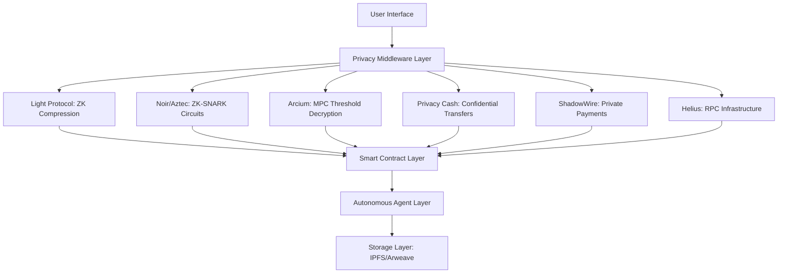
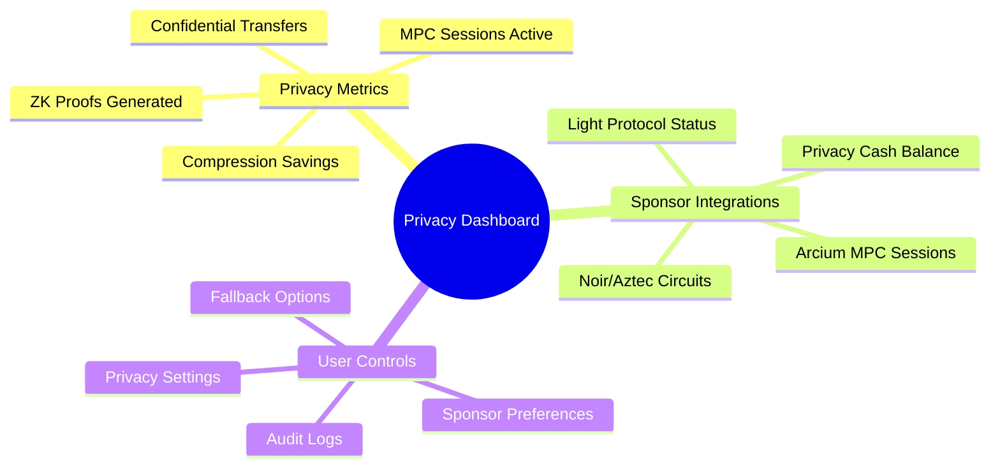

# Dallas Buyers Club: Architecture & Technical Design

## Overview
Dallas Buyers Club is a privacy-first health sovereignty platform built on Solana, featuring autonomous agents that coordinate encrypted health data sharing and validation. This document covers the technical architecture, agent system, privacy design, and sponsor integrations.

## Privacy Sponsor Integration Architecture

### Multi-Sponsor Privacy Stack



### Privacy Sponsor Integration Points

#### 1. Light Protocol Integration
- **Location**: `case_study.rs::submit_encrypted_case_study()`
- **Function**: ZK compression of case study metadata
- **Benefits**: 2-100x compression ratios, scalable private state
- **Implementation**: Light Protocol compression proofs with on-chain verification

#### 2. Noir/Aztec Integration
- **Location**: `case_study.rs::validator_prove_integrity()`
- **Function**: ZK-SNARK validation proofs without decryption
- **Benefits**: Data integrity verification, circuit-specific validation
- **Implementation**: Noir circuit IDs, parameter hashes, combined verification

#### 3. Arcium MPC Integration
- **Location**: `case_study.rs::request_committee_access()` and `approve_access_request()`
- **Function**: Threshold cryptography for selective decryption
- **Benefits**: K-of-N access control, end-to-end encryption
- **Implementation**: MPC session management, share proof verification

#### 4. Privacy Cash Integration
- **Location**: `experience_token.rs::reward_case_study()` and `stake_for_validation()`
- **Function**: Confidential token transfers and staking
- **Benefits**: Shielded rewards, private stake amounts
- **Implementation**: Optional privacy shielding with fallback to standard transfers

#### 5. ShadowWire Integration (Optional)
- **Location**: `experience_token.rs::reward_case_study()`
- **Function**: Private payment flows for treatment procurement
- **Benefits**: Shielded stablecoin transfers, private payment rails
- **Implementation**: Modular design for future expansion

## Privacy-Enhanced Product Design

### Core Privacy Principles

1. **Zero-Knowledge First**: All data interactions prioritize ZK proofs over plaintext
2. **Threshold Access**: Minimum K-of-N approvals required for decryption
3. **Confidential Transactions**: Privacy-preserving token flows by default
4. **Compression by Default**: Automatic Light Protocol compression for all submissions
5. **Circuit-Specific Validation**: Different Noir circuits for different validation types

### Privacy Sponsor Integration Matrix

| Sponsor | Integration Point | User Benefit | Technical Implementation |
|---------|------------------|--------------|--------------------------|
| Light Protocol | Case Study Submission | 2-100x storage savings | ZK compression with on-chain verification |
| Noir/Aztec | Validation Process | Prove integrity without decryption | Circuit-specific ZK-SNARK proofs |
| Arcium | Data Access | Secure threshold decryption | MPC with K-of-N validator approvals |
| Privacy Cash | Rewards & Staking | Confidential token transfers | Shielded EXPERIENCE distributions |
| ShadowWire | Payments | Private treatment procurement | Optional private payment rails |
| Helius | Infrastructure | Real-time coordination | High-performance RPC with webhooks |

### Privacy-First User Interface Design

#### Visual Privacy Language

1. **Compression Indicators**: Color-coded badges showing Light Protocol compression levels
   - 🟢 2-5x: Green (Standard)
   - 🔵 6-20x: Blue (Optimized)
   - 🟣 21-100x: Purple (Maximum)

2. **ZK Proof Status**: Icons indicating validation proof status
   - ⏳ Generating: Yellow (Pending)
   - ✅ Verified: Green (Complete)
   - ❌ Failed: Red (Error)

3. **MPC Approval Progress**: Visual progress bars for Arcium threshold approvals
   - 0/3: Red (Pending)
   - 1/3: Yellow (Partial)
   - 2/3: Orange (Almost)
   - 3/3: Green (Complete)

4. **Privacy Transfer Icons**: Visual cues for confidential transactions
   - 🛡️ Privacy Cash: Shield icon for confidential transfers
   - 🔒 ShadowWire: Lock icon for private payments
   - 📦 Standard: Box icon for regular transfers

#### Privacy Dashboard Components



### Enhanced Agent Network Design

#### Four Specialized Agents with Privacy Enhancements

Our platform operates 4 autonomous agents registered with Edenlayer Protocol, now with privacy sponsor integrations:

#### 1. Supply Chain Intelligence Agent
Handles treatment sourcing and distribution coordination:
- `check_treatment_availability`: Checks availability and pricing for treatments
- `negotiate_bulk_pricing`: Negotiates bulk pricing for group purchases

#### 2. Risk Assessment Agent
Corporate AI threat monitoring and risk analysis:
- `assess_transaction_risk`: Analyzes risk levels for operations
- `coordinate_emergency_response`: Coordinates network-wide emergency protocols

#### 3. Community Coordination Agent
Member network management and group coordination:
- `organize_group_purchase`: Coordinates group purchases among members

#### 4. Identity Restoration Agent
Treatment planning and multi-phase restoration coordination:
- `plan_restoration_sequence`: Creates personalized restoration plans

### Multi-Agent Workflows

#### Treatment Purchase Workflow
```json
[
  {
    "agentId": "risk-agent-id",
    "operation": "tools/assess_transaction_risk",
    "params": {
      "transactionType": "purchase",
      "amount": 0.5,
      "participantCount": 1
    }
  },
  {
    "agentId": "supply-agent-id",
    "operation": "tools/check_treatment_availability",
    "parents": ["0"],
    "params": {
      "treatmentIds": ["azt_patch"],
      "quantity": 1
    }
  },
  {
    "agentId": "identity-agent-id",
    "operation": "tools/plan_restoration_sequence",
    "parents": ["0", "1"],
    "params": {
      "fragmentationLevel": 65,
      "affectedSystems": ["digital_signature", "memory_core"],
      "timeframe": "standard"
    }
  }
]
```

#### Emergency Response Workflow
```json
[
  {
    "agentId": "risk-agent-id",
    "operation": "tools/coordinate_emergency_response",
    "params": {
      "emergencyType": "corporate_raid",
      "severity": 8
    }
  },
  {
    "agentId": "supply-agent-id",
    "operation": "tools/secure_supply_chain",
    "parents": ["0"],
    "params": {
      "securityLevel": "maximum",
      "redistributeInventory": true
    }
  }
]
```

## Core Architecture

### EnhancedBusinessLogic Service
Single source of truth for all business operations:
```typescript
class EnhancedBusinessLogic {
  processIdentityRestoration(params): AgentResult
  assessTransactionRisk(params): RiskAssessment
  checkTreatmentAvailability(params): Treatment[]
  organizeGroupPurchase(params): GroupPurchaseResult
}
```

### State Management
Centralized agent state via `useAgentNetwork` hook:
```typescript
const {
  agentStatus,        // Current agent states
  coordinations,      // Active multi-agent workflows
  riskLevel,          // Current risk assessment
  availableTreatments // Inventory status
} = useAgentNetwork()
```

### UI Components
Consolidated component system in `SharedUIComponents.tsx`:
- Modal system for transactions and alerts
- Loading states with agent progress
- Network status indicator
- Danger level display
- Terminal interface for commands

## Privacy Architecture

### Wallet-Derived Key Encryption
Zero-knowledge data privacy model:
1. User connects wallet
2. Signs message: "Authenticate Dallas Buyers Club Identity Node"
3. PBKDF2 (SHA-256) on signature derives AES-GCM-256 encryption key
4. Key encrypts/decrypts localStorage data
5. Key exists only in memory for session

### Confidential Transfer Layer
On-Chain Encrypted Memo Protocol:
- **Service**: `ConfidentialTransferService.ts`
- **Mechanism**: Attaches SPL Memo with AES-GCM encrypted metadata
- **Security**: Encrypted with sender's wallet-derived key
- **UX**: "Shielded" mode in SolanaTransfer component

### Wallet Integration
Solana Web3.js integration via `WalletContext`:
- Connect/disconnect Phantom wallet
- Message signing for key derivation
- Transaction signing for standard and confidential transfers
- Encrypted transaction history tracking
- Payment confirmation handling

## Protocol Integration

### MCP (Model Context Protocol)
- Agent discovery and registration
- Tool capability advertisement
- Request/response handling
- Error recovery and fallback strategies

### Edenlayer Protocol
- Agent registration and discovery
- Task execution and composition
- Real blockchain transaction triggering
- Persistent state management across agents

## Code Organization

```
agents/
├── AgentFoundation.ts       # Base agent interfaces
└── CoreAgentNetwork.ts      # 4-agent coordination system

services/
├── EnhancedBusinessLogic.ts # Business logic + agents
└── transactionHistory.ts    # Transaction persistence

components/
├── SharedUIComponents.tsx   # Consolidated UI system
└── EnhancedBlackMarketExperience.tsx  # Main UX

hooks/
└── useAgentNetwork.ts       # Agent state management

context/
└── WalletContext.tsx        # Wallet state

config/
└── solana.ts               # Solana network config
```

## Performance Optimizations
- Parallel Agent Execution: Multiple agents coordinate simultaneously
- Smart Caching: Agent decisions cached to prevent redundant processing
- Optimized Re-renders: State updates only trigger affected components
- Code Splitting: Clear module boundaries for efficient loading

## Scalability
- New Agents: Add specialized agents by extending base interfaces
- New Workflows: Compose agents for complex multi-step operations
- Cross-System Integration: Agents discoverable in broader Edenlayer ecosystem
- Fault Tolerance: Agent failures don't cascade; system degrades gracefully
