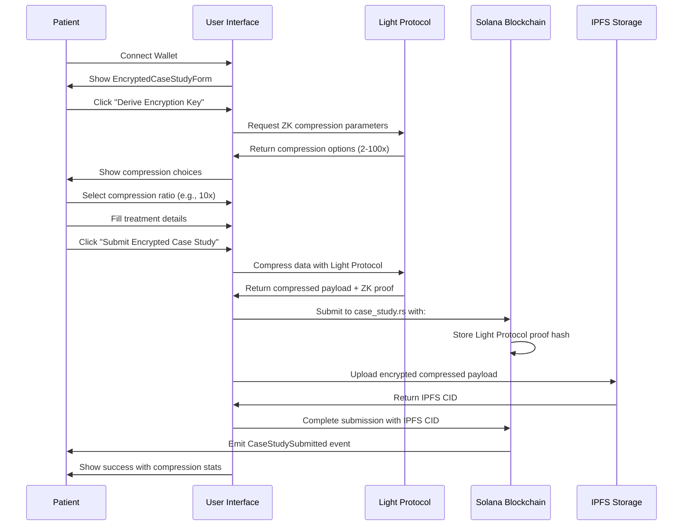
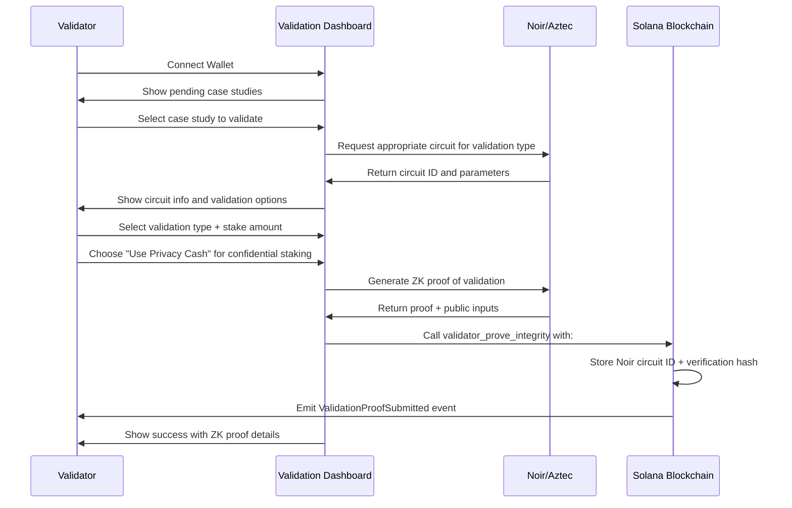
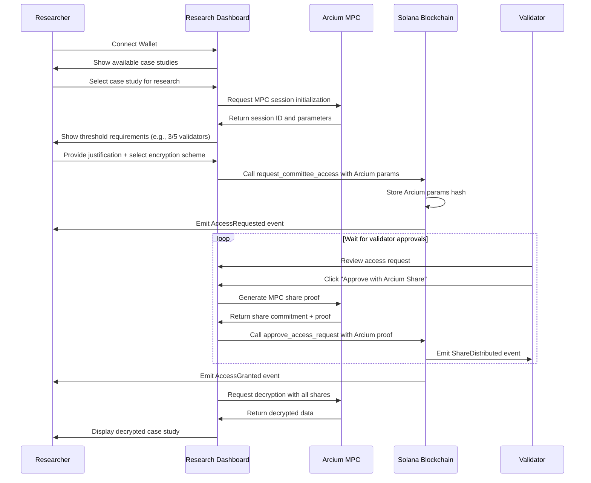
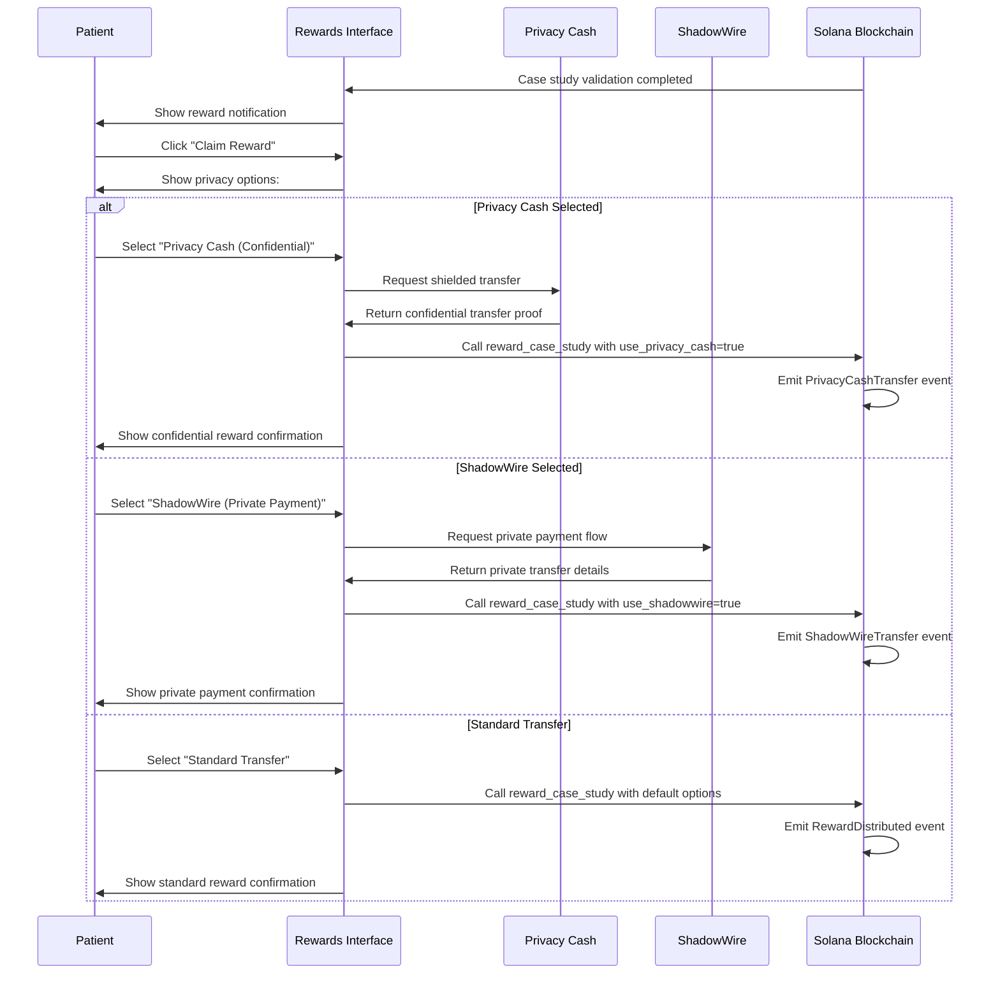
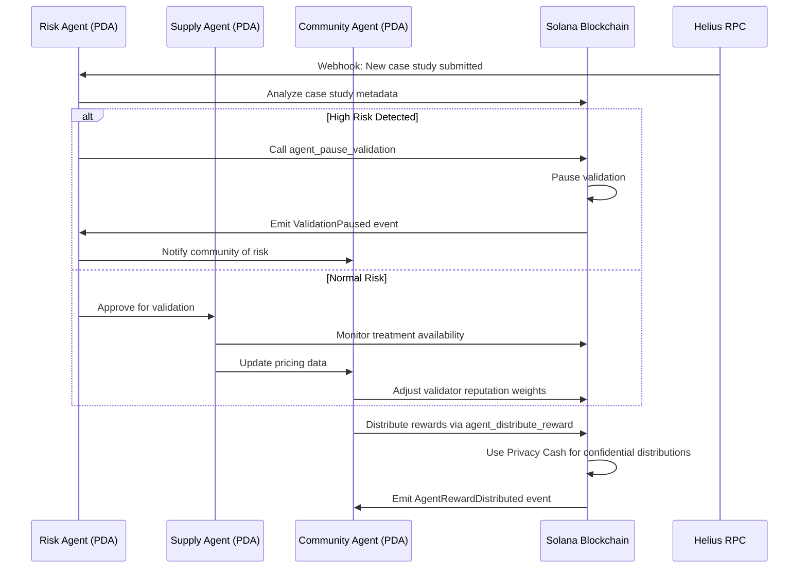

# Dallas Buyers Club: Privacy-Enhanced User Flows

## Overview
This document describes the enhanced user flows incorporating privacy sponsor integrations (Light Protocol, Noir/Aztec, Arcium, Privacy Cash, ShadowWire).

## Patient User Flow: Submit Encrypted Case Study with Light Protocol Compression

### Enhanced Form Elements
- **Compression Selector**: Dropdown to choose Light Protocol compression ratio (2x, 5x, 10x, 20x, 50x, 100x)
- **Privacy Sponsor Info**: Tooltips explaining each sponsor's role
- **Compression Preview**: Estimated storage savings display

## Validator User Flow: Validate with Noir/Aztec ZK Proofs

### Enhanced Validation Features
- **Circuit Selection**: Automatic Noir circuit selection based on validation type
- **Privacy Cash Toggle**: Checkbox to enable confidential staking
- **ZK Proof Visualization**: Proof hash and circuit parameter display
- **Reputation Impact**: Real-time reputation score preview

## Researcher User Flow: Request Arcium MPC Decryption

### Enhanced Research Features
- **MPC Session Dashboard**: Real-time approval tracking (3/5 validators approved)
- **Encryption Scheme Selector**: AES-256, ChaCha20, or Custom options
- **Arcium Proof Explorer**: Visualization of MPC share commitments
- **Decryption Audit Log**: Complete history of access requests and approvals

## Reward Distribution Flow: Privacy Cash & ShadowWire

### Enhanced Reward Features
- **Privacy Toggle**: Radio buttons for Privacy Cash vs ShadowWire vs Standard
- **Confidentiality Indicator**: Visual cues showing transfer privacy level
- **Reward Breakdown**: Detailed token allocation explanation
- **Historical Privacy**: Past reward privacy settings display

## Agent Coordination Flow: Privacy-Aware Autonomous Operations

### Enhanced Agent Features
- **Privacy-Aware Risk Analysis**: ZK proof validation without decryption
- **Confidential Rewards**: Privacy Cash integration for agent distributions
- **Real-time Monitoring**: Helius webhook-driven agent coordination
- **Transparent Governance**: On-chain agent action logging

## Technical Implementation Details

### Light Protocol Integration Points
- **UI**: Compression ratio selector in EncryptedCaseStudyForm
- **Smart Contract**: `light_protocol_proof` parameter in `submit_encrypted_case_study`
- **Storage**: Compression ratio and proof hash stored in CaseStudy account
- **Events**: `CaseStudySubmitted` includes Light Protocol details

### Noir/Aztec Integration Points
- **UI**: Circuit selection and ZK proof generation in ValidationDashboard
- **Smart Contract**: `noir_circuit_id` and `circuit_params_hash` in `validator_prove_integrity`
- **Storage**: Circuit verification hash stored in ValidatorStake account
- **Events**: `ValidationProofSubmitted` includes Noir verification details

### Arcium Integration Points
- **UI**: MPC session dashboard and share approval tracking
- **Smart Contract**: `arcium_mpc_params` in `request_committee_access`
- **Storage**: Arcium params hash and encryption scheme in AccessRequest account
- **Events**: `ArciumSessionInitialized` and `ArciumDecryptionComplete` events

### Privacy Cash Integration Points
- **UI**: Privacy toggle in reward claiming interface
- **Smart Contract**: `use_privacy_cash` parameter in `reward_case_study` and `stake_for_validation`
- **Storage**: Shielded status in StakeAccount
- **Events**: `PrivacyCashTransfer` and `PrivacyCashShield` events

### ShadowWire Integration Points
- **UI**: Private payment option in reward interface
- **Smart Contract**: `use_shadowwire` parameter in `reward_case_study`
- **Events**: `ShadowWireTransfer` event

## User Experience Enhancements

### Visual Privacy Indicators
- **Compression Badges**: "10x Light Protocol Compression" badges on case studies
- **ZK Proof Icons**: 🔐 icons indicating ZK-SNARK validation
- **MPC Status**: "3/5 Approvals" progress bars for decryption requests
- **Privacy Shields**: 🛡️ icons for confidential transfers

### Educational Tooltips
- **Light Protocol**: "Your data is compressed 10x using Light Protocol ZK compression"
- **Noir/Aztec**: "Validators prove data integrity without seeing your private information"
- **Arcium MPC**: "Your data requires 3 independent validators to approve decryption"
- **Privacy Cash**: "Your rewards are transferred confidentially to protect your privacy"

### Privacy Dashboard
- **Compression Stats**: Total storage saved via Light Protocol
- **ZK Proof Count**: Number of Noir proofs generated
- **MPC Sessions**: Active Arcium decryption sessions
- **Confidential Transfers**: Privacy Cash and ShadowWire transaction history

## Error Handling and User Guidance

### Common Privacy Errors and Solutions

| Error | Cause | User Solution |
|-------|-------|--------------|
| `InvalidCompressionRatio` | Compression ratio outside 2-100x range | Select valid compression ratio |
| `MissingLightProtocolProof` | Light Protocol proof not provided | Retry submission with compression |
| `InvalidCircuitId` | Invalid Noir circuit selected | Use default circuit or contact support |
| `MissingArciumParams` | Arcium MPC parameters missing | Provide valid MPC parameters |
| `MissingArciumShareProof` | Arcium share proof not provided | Regenerate MPC share proof |

### Privacy Fallback Mechanisms
- **Compression Failure**: Fallback to uncompressed submission with warning
- **ZK Proof Failure**: Fallback to standard validation with reputation penalty
- **MPC Failure**: Fallback to standard access control with logging
- **Privacy Cash Failure**: Fallback to standard transfers with notification

## Performance Considerations

### Optimization Strategies
- **Adaptive Compression**: Automatically select optimal Light Protocol compression ratio
- **Circuit Caching**: Cache frequently used Noir circuits for faster validation
- **Batch MPC**: Batch Arcium MPC operations for efficiency
- **Lazy Privacy**: Defer Privacy Cash operations until necessary

### Resource Management
- **Compression Limits**: Maximum 100x compression to prevent excessive computation
- **ZK Proof Size**: Limit proof sizes to maintain blockchain efficiency
- **MPC Timeout**: 24-hour timeout for Arcium decryption sessions
- **Privacy Throttling**: Rate limiting for confidential transfers

## Future Enhancements

### Roadmap Items
- **Cross-Sponsor Analytics**: Dashboard showing combined privacy benefits
- **Automated Circuit Selection**: AI-driven Noir circuit recommendations
- **MPC Performance Monitoring**: Real-time Arcium session performance tracking
- **Privacy Health Score**: Composite privacy metric for users
- **Sponsor Integration Wizard**: Guided setup for new privacy sponsors

### Research Directions
- **Homomorphic Encryption**: Private computation on encrypted data
- **Federated Learning**: Privacy-preserving treatment efficacy models
- **Cross-Chain Privacy**: Multi-blockchain privacy bridges
- **Quantum-Resistant Cryptography**: Future-proof encryption schemes